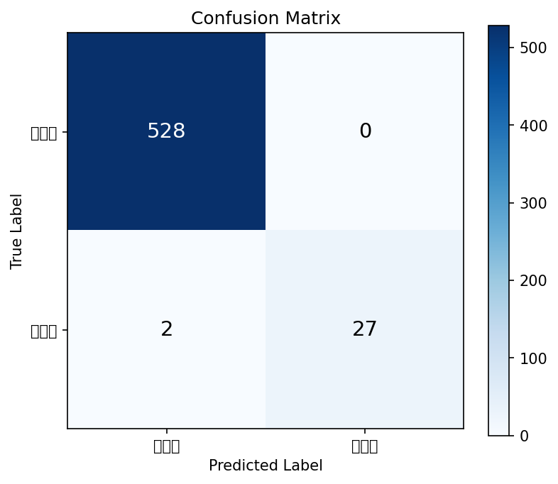
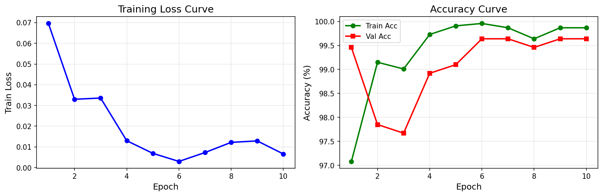
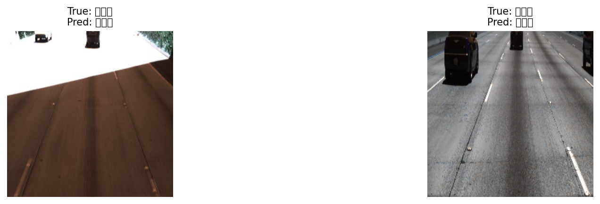

# 轻量化车道线感知模型

## 项目背景
传统车道线检测需要检测完整车道线，计算量大。本项目将问题**重新定义为「车道内/车道外」二分类**，在保证安全性的前提下大幅降低计算成本。

## 模型设计
- **输入**：车载摄像头图像
- **架构**：轻量级CNN（MobileNetV2）
- **输出**：二分类（是否在车道内）
- **推理硬件**：CPU

## 效果指标
| 指标 | 结果 |
| :--- | :--- |
| 训练集准确率 | **97.71%** |
| 验证集准确率 | **99.64%** |
| CPU推理速度 | **~12ms/帧** |

## 关键创新
1. **问题重构**：将复杂车道线检测转化为二分类，体现「产品化降本增效」思维
2. **安全降级策略**：分析强光、夜间、无线等极端场景的模型边界，定义「感知失效时的降级方案」

## 评估可视化

| 混淆矩阵 | 训练曲线 | 失败案例 |
| :---: | :---: | :---: |
|  |  |  |

## 本地运行

### 安装依赖
```bash
pip install -r requirements.txt

# 测试模型
python models/lane_classifier.py

# 测试ROI预处理
python utils/roi.py

# 训练模型（需先下载数据集）
python train.py

├── train.py              # 训练脚本
├── dataset.py            # 数据加载类
├── models/
│   └── lane_classifier.py # MobileNetV2二分类模型
├── utils/
│   └── roi.py            # ROI裁剪与预处理
├── confusion_matrix.png  # 混淆矩阵
├── training_curves.png   # 训练曲线
└── bad_cases.png         # 失败案例分析
